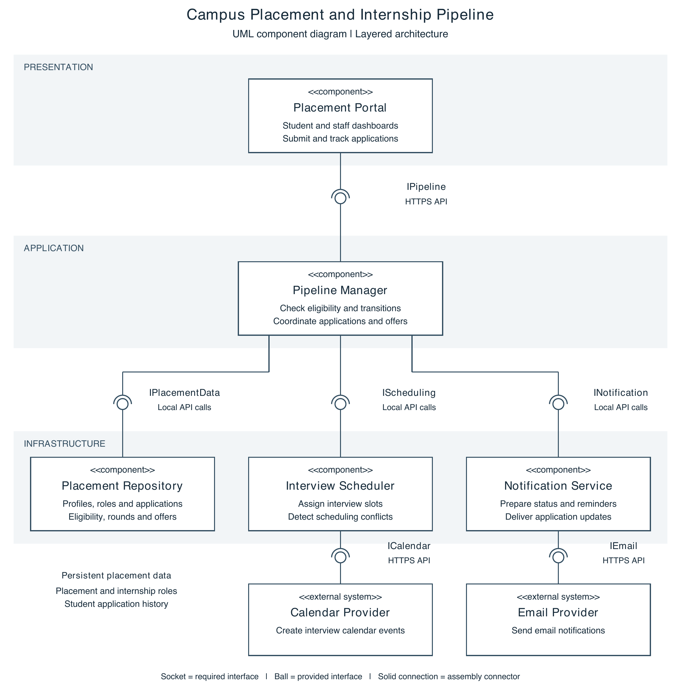

# Lab 3: Component Modelling and Architectural Pattern Selection

## Campus Placement & Internship Pipeline

**Name:** Ayush Ravindra Paithankar  
**SRN:** PES1UG24CS104

## Overview

This submission presents a layered architecture for managing campus placement and internship applications. It covers eligibility checks, application tracking, interview scheduling, recruitment status updates, and offers.

## Submission Files

| File | Contents |
| --- | --- |
| [Word submission](Lab3_Placement_Submission.docx) | One-page architecture justification followed by the UML component diagram and interaction flow. |
| [PDF submission](Lab3_Placement_Submission.pdf) | PDF version of the complete submission. |
| [Component diagram](Lab3_Placement_Component_Diagram.png) | Standalone UML component diagram in PNG format. |

## Selected Architecture

**Layered Architecture** separates the presentation, application workflow, and infrastructure responsibilities. The justification compares Layered, Microservices, and Client-Server architectures and explains two scenario-specific reasons for the selection, a security advantage, and a performance benefit.

| Layer | Components | Responsibility |
| --- | --- | --- |
| Presentation | Placement Portal | Student and staff dashboards; application submission and tracking. |
| Application | Pipeline Manager | Eligibility checks, application transitions, and workflow coordination. |
| Infrastructure | Placement Repository | Store profiles, opportunities, applications, eligibility criteria, rounds, and offers. |
| Infrastructure | Interview Scheduler | Assign interview slots and detect scheduling conflicts. |
| Infrastructure | Notification Service | Send application updates and reminders. |

## Component Interfaces

| Interface | Required by | Provided by |
| --- | --- | --- |
| `IPipeline` | Placement Portal | Pipeline Manager |
| `IPlacementData` | Pipeline Manager | Placement Repository |
| `IScheduling` | Pipeline Manager | Interview Scheduler |
| `INotification` | Pipeline Manager | Notification Service |

The diagram uses UML ball notation for provided interfaces and socket notation for required interfaces. It also shows external calendar and email providers through `ICalendar` and `IEmail`.

## Main Interaction Flow

1. Students browse opportunities, submit applications, and view status through the Placement Portal.
2. The Pipeline Manager retrieves profiles and criteria, checks eligibility, and stores valid applications.
3. Authorized staff schedule interviews. The Interview Scheduler checks conflicts and coordinates calendar events.
4. Staff record recruitment outcomes, and the Pipeline Manager saves application and offer updates.
5. The Notification Service sends updates through the email provider. Failed external operations remain pending for retry.

## Diagram Preview

